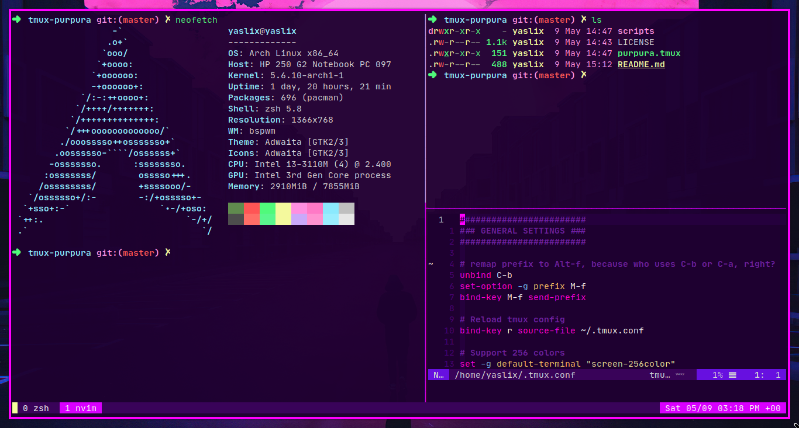

# Purpura for [tmux](https://github.com/tmux/tmux/wiki)

> A [purpura](https://github.com/yassinebridi/vim-purpura) theme for [tmux](https://github.com/tmux/tmux/wiki)

All the heavy work is done by [Dracula](https://github.com/dracula/tmux)

A similar theme for vim is here: [vim-purpura](https://github.com/yassinebridi/vim-purpura)

## Install

- Make sure to put `run -b '~/.tmux/plugins/tpm/tpm'` at the bottom of your .tmux.conf
- Run tmux
- Use the tpm install command: prefix + I
